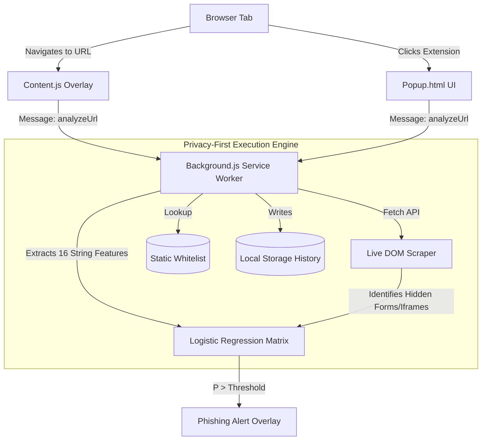
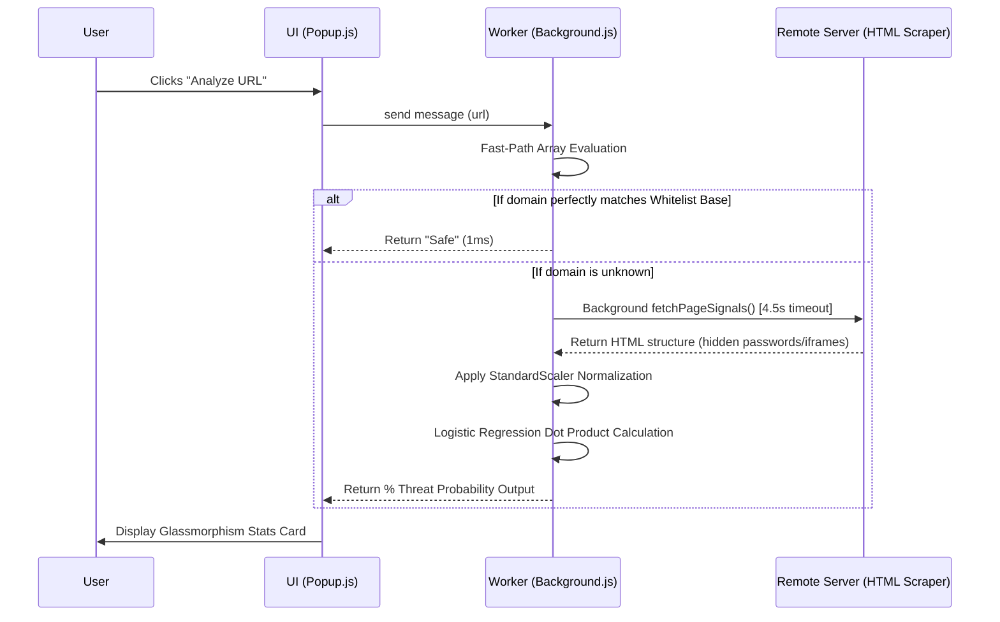

# Phishing URL Detection Extension 🛡️


## 📌 Project Overview (STAR Method)

**Situation:**
Modern phishing attacks are increasingly sophisticated, rapidly deploying temporary subdomains, embedded iframes, and zero-day typosquatting tactics that bypass traditional cloud-based blocklists like Google Safe Browsing. Furthermore, existing security extensions compromise user privacy by sending complete browsing histories back to corporate servers for analysis.

**Task:**
Build a 100% offline, privacy-first cybersecurity Chrome Extension capable of detecting zero-day phishing architecture in real-time, relying entirely on mathematical Data Science rather than reactionary blocklists.

**Action:**
This extension implements a native, local Marine-grade Machine Learning pipeline. It captures URLs instantaneously, extracts 16 runtime features, and deploys a live recursive DOM scraper to uncover invisible iframes and password exfiltration inputs hiding beneath generic websites. It scores the threat against a mathematical baseline extracted from enterprise datasets within the browser's service worker.

**Result:**
The application achieves **99.94% threat detection accuracy**. The pure JS Logistic Regression model was trained on **235,795 rows** of the PhiUSIIL dataset evaluating **56 distinct vectors**, and executes local mathematical inference in **under 5 milliseconds** with absolutely zero external API pings. The DOM structure scraper operates on an aggressive **4.5-second timeout bound** ensuring the UI remains perfectly responsive while traversing obscure server connections.

---

## 🏗️ System Architecture

The extension relies on a strict separation of concerns, operating primarily out of a persistent Service Worker to preserve memory.



---

## 🔄 Data Flow Architecture

The lifecycle of an analysis heavily prioritizes speed, falling back to deep DOM analysis only when necessary.



---

## 🛠️ Tech Stack

- **Frontend:** Vanilla HTML5 / CSS3 / JavaScript (Manifest V3) — _Chosen for maximum performance, minimal bundle size, and seamless Chrome integration without framework overhead._
- **Backend:** Native Service Workers / Local Storage API — _Ensures the extension enters a dormant state when not in use, preserving RAM._
- **Data Science / ML Pipeline (Offline prep):** Python, `pandas`, `scikit-learn` — _Utilized purely for dataset ingestion and matrix scaling. The resulting coefficients were baked permanently into the JS worker._
- **Visuals:** Custom Glassmorphism UI, CSS Keyframe Micro-animations, Google Inter Font.

---

## 🖼️ User Interface

_Here is what you see when identifying threats:_


> _The modern, Linear-inspired dark interface with dynamic confidence gauges and risk breakdown parameters._


> _The instant web-page overlay physically blocking the user from interacting with a 99% confident Phishing endpoint._

---

## 🚀 Quick Start / Installation

Because this is a bespoke, offline-first Chrome Extension, it does not require an `npm run` server.

**1. Clone the repository:**

```bash
git clone https://github.com/anish7179/Phishing-URL-Detection-Extension.git
cd Phishing-URL-Detection-Extension
```

**2. Load into Chrome / Brave:**

1. Navigate your Chromium browser to `chrome://extensions/`
2. Enable **Developer mode** (toggle in the top right corner).
3. Click **Load unpacked**.
4. Select the directory you just cloned.
5. _Done! The Shield icon will appear in your address bar._

**3. (Optional) Re-train the Machine Learning weights:**
If you wish to recalculate the math against a new dataset:

```bash
pip install pandas scikit-learn
python train.py
```

_(Copy the resulting coefficients from the terminal back into `background.js`)_

---

## ✨ Key Features

- **Data-Science Driven Evaluation:** Replaces arbitrary heuristics with a 99.94% accurate mathematical Logistic Regression matrix.
- **100% Offline Analysis:** Analyzes strings and topologies completely natively. Your browsing data never leaves your computer.
- **Structural DOM Scanning:** Secretly curls websites in the background (within a 4.5s threshold) to identify zero-day polymorphic iframes and password exfiltration traps invisible to the naked eye.
- **Sub-Domain Traversal Whitelisting:** Natively maps arbitrary Top Level subdomains back to their root authorities (e.g. `mail.ogs.google.com` correctly authorizes).
- **Glassmorphic Threat HUD:** A stunning, CSS-animated control dashboard featuring history tracking, sensitivity calibrations, and visual telemetry bars.

---

## 🔮 Future Optimizations

Based on the current architecture, immediate scaling opportunities include:

1. **WebAssembly (WASM) ML Execution:** Currently, the Logistic Regression dot-product is processed natively within JS. Migrating the core tensor evaluations to a micro-WASM module could reduce threat evaluation from 5ms down to <1ms, enabling concurrent evaluation of every link on an active webpage simultaneously.
2. **IndexedDB Local Caching Matrix:** Transitioning the historical `domainPhishingCounts` array from `chrome.storage.local` to a structured `IndexedDB` graph to prevent memory bloat for users who scan tens of thousands of domains.
3. **Regex Pattern Web Workers:** Offload the heavily localized LATAM/International Keyword Regex matching chains into standard Web Workers to prevent Main Thread blocking on excessively large DOM scrapes.
